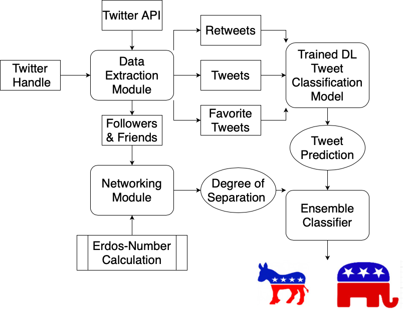
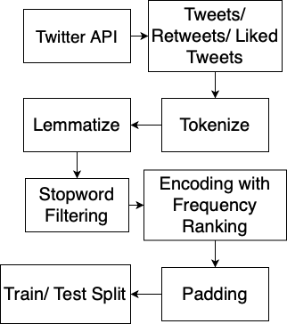
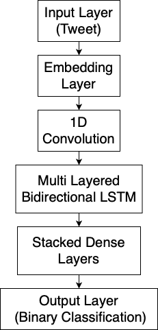
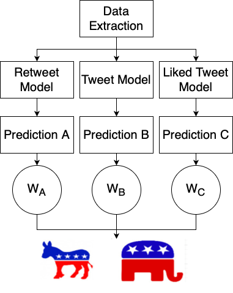
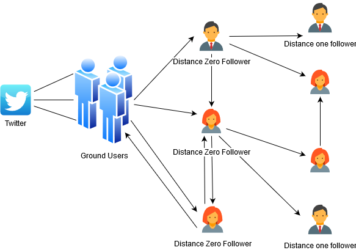
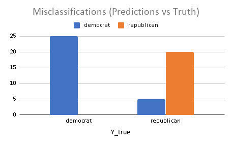
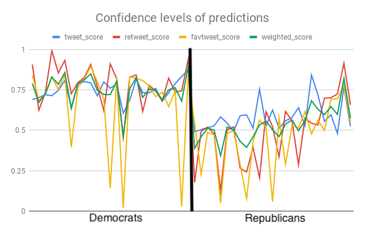
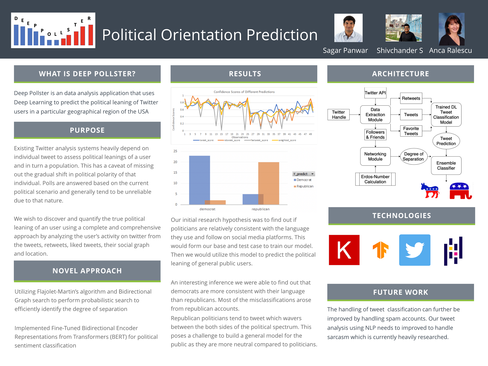

# Deep Pollster: Political Orientation Prediction

> University of Cincinnati Senior Design 2020

> Deep Pollster is an data analysis application that uses Deep Learning to predict the political leaning of Twitter users in a particular geographical region of the USA

Table of contents
=================

<!--ts-->
   * [Project Description](#project-description)
        * [Abstract](#abstract)
        * [Team Members](#team-members)
        * [Project Advisor](#faculty-advisor)
        * [Challenges](#challenges)
        * [Solution](#solution)
   * [Architecture](#architecture)
        * [Modules](#modules)
            * [Data Extraction](#data-extraction-module)
                * [Dataset](#dataset)
            * [Model](#model)
                * [Classification Model](#classification-model)
                * [Ensemble Classifier](#ensemble-classifier)
            * [Networking](#networking-module)
        * [Technologies](#technologies)
   * [Testing & Results](#testing--results)
        * [Test Plan](#test-planassignmentsassignment-1testplanmd)
        * [Test Case](#test-case)
        * [Results](#results)
            * [Result 1](#result-1)
            * [Result 2](#result-2)
        * [Inference](#inference)
   * [Future Work](#future-work)
   * [User Manual](#user-manual)
   * [Video](#videohttpswwwyoutubecomwatchvcv4k47oorfafeatureyoutube)
   * [Presentation](#presentationassignmentsassignment-3deeppollster_presentationpdf)
   * [Poster](#poster)
   * [Assessments](#assessments)
        * [Initial Self-Assessment](#initial-self-assessment)
        * [Final Self-Assessment](#final-self-assessment)
   * [Summary of Hours](#summary-of-hours)
   * [Assignments](assignments)
   * [Appendix](#license)
<!--te-->

Project Description
===================

## Abstract

Social Networking has risen to a place of prominence as a medium of publishing information. Times are constantly changing, and the power to sway and portray political opinions is shifting from traditional media such as newspapers and television networks to social media platforms like twitter. This has given rise to new directions of research in Computational Political Science.

In this venture we reexamine the problem of measuring and predicting the political orientation of twitter users. We expect to contribute to the study of the political blogosphere by incorporating multiple hypotheses about the behavior of the average twitter user and a registered politician, alike. Incorporating ideas such as tweets, retweets, subtweeting, followers and followees network and degrees of separation helps us understand the twitter political scenario better and helps us better understand how to leverage these sources of information. In recent times, hundreds of researchers take to twitter to analyze the effect of twitter on major political events such as the 2016 and 2020 U.S. elections, and we think that our technical contribution would be the reimagination of the traditional problem of predicting the political leaning of a given user. 

By studying the political orientation of twitter users, it is possible to target advertisements at individuals, shape digital profiles, and deliver news, articles, views and products that are individualistic and personalized. This could also be used to predict the political outcome of an election by predicting the leaning of users in a geographical location.

> Index Terms - Twitter, Political Science, NLP, Deep Learning, Neural Networks

## Challenges
Sentiment analysis on tweets to assess political leaning has its disadvantages :

* Does not paint a complete and holistic picture of the users' ideological views
* Cannot build a digital profile of a user from a single or even with a temporal series of tweets   
* Assessing political leaning of a demography does not serve the purposes and intents of individual orientation   

## Solution
We leverage more than just tweet-retweet maximization, or a network matrix :     

* Binary classification of the latest tweets, retweets and liked tweets on the basis of political leaning
* Identifying the degree of separation between the user and politicians from both the political sides 

Our proposed system is curated to provide a more rounded and holistic sense of the individual user, painting an overall picture of their digital profile, leading to potential in marketing and business spheres.   

## Team Members

   Shivchander Sudalairaj - sudalasr@mail.uc.edu
   
   Sagar Panwar - panwarsr@mail.uc.edu
  
## Faculty Advisor

Anca Ralescu - ralescal@ucmail.uc.edu

Architecture
============

## Modules

### Data Extraction Module

### Dataset
> [Link to download the dataset](https://www.kaggle.com/kapastor/democratvsrepublicantweets)

### Model

#### Classification Model

#### Ensemble Classifier

### Networking Module
> Degree of Seperation (Erdos Number)

## Technologies

* [Twitter API](https://developer.twitter.com/en/docs)
* [Keras](https://keras.io)
* [Tensorflow](https://www.tensorflow.org)
* [Pandas](https://pandas.pydata.org)

Testing & Results
=================
## [Test Plan](assignments/assignment-1/testplan.md)

## Test Case
* The model was tested with multiple sets of test cases to eliminate any innate bias
* Each sets of test cases consists of a set of 50 previously untested politicians’ twitter handles

_Hypothesis : Politicians are relatively consistent with the language models that they follow while publishing tweets on twitter_

## Results

### Result 1

>After running our tests, we observed that our model was able to predict democratic politicians with 100% accuracy
While the misclassifications arose with republican politicians resulting with an accuracy of 80%

### Result 2

>After running our tests, we observed that our model was able to identify democrats with significantly higher confidence than republicans.

>We also observed that predictions from tweets model was more stable than retweets and liked tweets. This supports our initial hypothesis for variable weights

## Inference

* Democratic tweets consistently fall on the political left
* Republican tweets falls more on political centre and centre-right
* Democrats are more consistent with their language and in turn political ideologies used on twitter
* Republicans use language which is more ambiguous and tend to waver between left and right of the political spectrum
* Naively extrapolating this model to general public users will cause inherent bias 

Future Work
===========
* The handling of tweet content analysis and classification can further be improved to handle spam accounts. It is also to be noted that sarcasm is yet to be handled by our model and additions could be made to account for this
* To develop a generalized model to be applicable for general public users, we would need to survey users and find out their political orientation to develop a more general dataset and retrain the model using the dataset

[User Manual](usermanual.md)
========================================

[Video](https://www.youtube.com/watch?v=cv4K47OorfA&feature=youtu.be)
===================================================================

[Presentation](assignments/assignment-3/DeepPollster_Presentation.pdf)
======================================================================

Poster
======

Assessments
===========

## Initial Self-Assessment

* [Shivchander Sudalairaj](assesments/shiv_fall_assessment.md)
* [Sagar Panwar](assesments/sagar_fall_assessment)

## Final Self-Assessment

* [Shivchander Sudalairaj](assesments/shiv_final_assessment.md)
* [Sagar Panwar]()

Summary of Hours
================

[Assignments](assignments)
==========================

License
=======

- **[MIT license](LICENSE)**
- Copyright 2020
