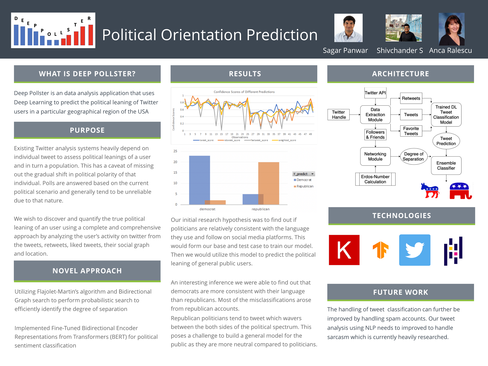

# Deep Pollster: Political Orientation Prediction

> University of Cincinnati Senior Design 2020

> Deep Pollster is an data analysis application that uses Deep Learning to predict the political leaning of Twitter users in a particular geographical region of the USA

Table of contents
=================

<!--ts-->
   * [Project Description](#project-desc)
        * [Abstract](#abstract)
        * [Team Members](#team)
        * [Project Advisor](#advisor)
   * [Testing & Results](#testing)
        * [Test Plan](#testplan)
        * [Test Case](#testcase)
        * [Results](#results)
            * [Result 1](#result-1)
            * [Result 2](#result-2)
        * [Inference](#inference)
   * [User Manual](#user-manual)
   * [Demo](#demo)
   * [Presentation](#powerpoint)
   * [Poster](#poster)
   * [Professional Biographies](#bios)
        * [Shivchander Sudalairaj](#shiv)
        * [Sagar Panwar](#sagar)
   * [Appendix](#appendix)
<!--te-->

Project Description
===================

## Abstract

Social Networking has risen to a place of prominence as a medium of publishing information. Times are constantly changing, and the power to sway and portray political opinions is shifting from traditional media such as newspapers and television networks to social media platforms like twitter. This has given rise to new directions of research in Computational Political Science.

In this venture we reexamine the problem of measuring and predicting the political orientation of twitter users. We expect to contribute to the study of the political blogosphere by incorporating multiple hypotheses about the behavior of the average twitter user and a registered politician, alike. Incorporating ideas such as tweets, retweets, subtweeting, followers and followees network and degrees of separation helps us understand the twitter political scenario better and helps us better understand how to leverage these sources of information. In recent times, hundreds of researchers take to twitter to analyze the effect of twitter on major political events such as the 2016 and 2020 U.S. elections, and we think that our technical contribution would be the reimagination of the traditional problem of predicting the political leaning of a given user. 

By studying the political orientation of twitter users, it is possible to target advertisements at individuals, shape digital profiles, and deliver news, articles, views and products that are individualistic and personalized. This could also be used to predict the political outcome of an election by predicting the leaning of users in a geographical location.

> Index Terms - Twitter, Political Science, NLP, Deep Learning, Neural Networks

## Team Members

   Shivchander Sudalairaj - sudalasr@mail.uc.edu
   
   Sagar Panwar - panwarsr@mail.uc.edu
  
## Faculty Advisor

Anca Ralescu - ralescal@ucmail.uc.edu

Demo
====
> Video Link to the Project Demo 

[Twitter Sentiment Analysis - CS Senior Design](https://www.youtube.com/watch?v=cv4K47OorfA&feature=youtu.be)

Presentation
============
[Final Presentation](assignments/assignment-3/DeepPollster_Presentation.pdf)

Poster
======
